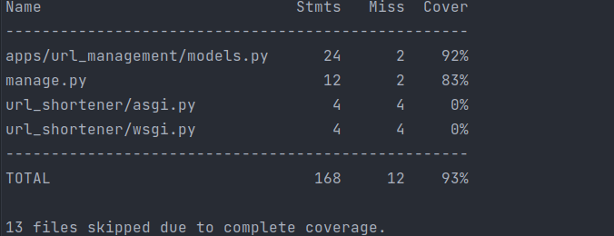

# URL Shortener
___
### Service that creates short URLs for URLs  with Django and DRF ###

For example the url `https://mysite.com/` to `http://domain:8000/jCg6qTk`.
## Run Project
1. Copy the `.env.example` to `.env`
```
cp .env.example .env
```
You can update the `SHORTENER_BLOCK_SIZE` value for the shortcode size
2. Use `Make`:
```
make build # Build the image
make start # Start the containers
make createsuperuser # Create a super user
```
3. Access to `http://localhost:8000/`

## Usage
### Generate short URL ###
- **URL:** `generate/short/url/`
- **Method:** `POST`
- **Code:** `200`
- **Body request:** 
```
{
    "url": "https://fondeadora.com/"
}
```
- **Response:**
```
{
    "shortcode": "http://ec2-54-151-58-135.us-west-1.compute.amazonaws.com:8000/jCg6qTk"
}
```

### Decode shortcode ###
- **URL:** `decode/short/url/{shortcode}`
- **Method:** `POST`
- **Code:** `200`
- **Body request:** `No`
- **Response:**
```
{
    "url": "https://fondeadora.com/"
}
```
### Redirect short URL ###
- **URL:** `/{shortcode}`
- **Method:** `GET`
- **Code:** `302`
- **Body request:** `No`
- **Response:** `No`
- **The endpoint must redirect to original URL**

## Test
1. Use `Make`
```
make coverage-run # Run coverage test
make coverage-report # Run coverage report
```



## Swagger##
#### Swagger docs
**url**: `docs/`
## Postman Collection
[](https://god.gw.postman.com/run-collection/587528-1f868cf7-ec03-4c59-9857-deb0d129ca2e?action=collection%2Ffork&collection-url=entityId%3D587528-1f868cf7-ec03-4c59-9857-deb0d129ca2e%26entityType%3Dcollection%26workspaceId%3D87227067-2bba-4862-97e3-a425444e8ff4#?env%5BUrl%20Shortener%5D=W3sia2V5IjoiQkFTRV9VUkwiLCJ2YWx1ZSI6Imh0dHBzOi8vZDNiYS0xODktMTI5LTktOTUubmdyb2suaW8iLCJlbmFibGVkIjp0cnVlLCJ0eXBlIjoiZGVmYXVsdCJ9XQ==)